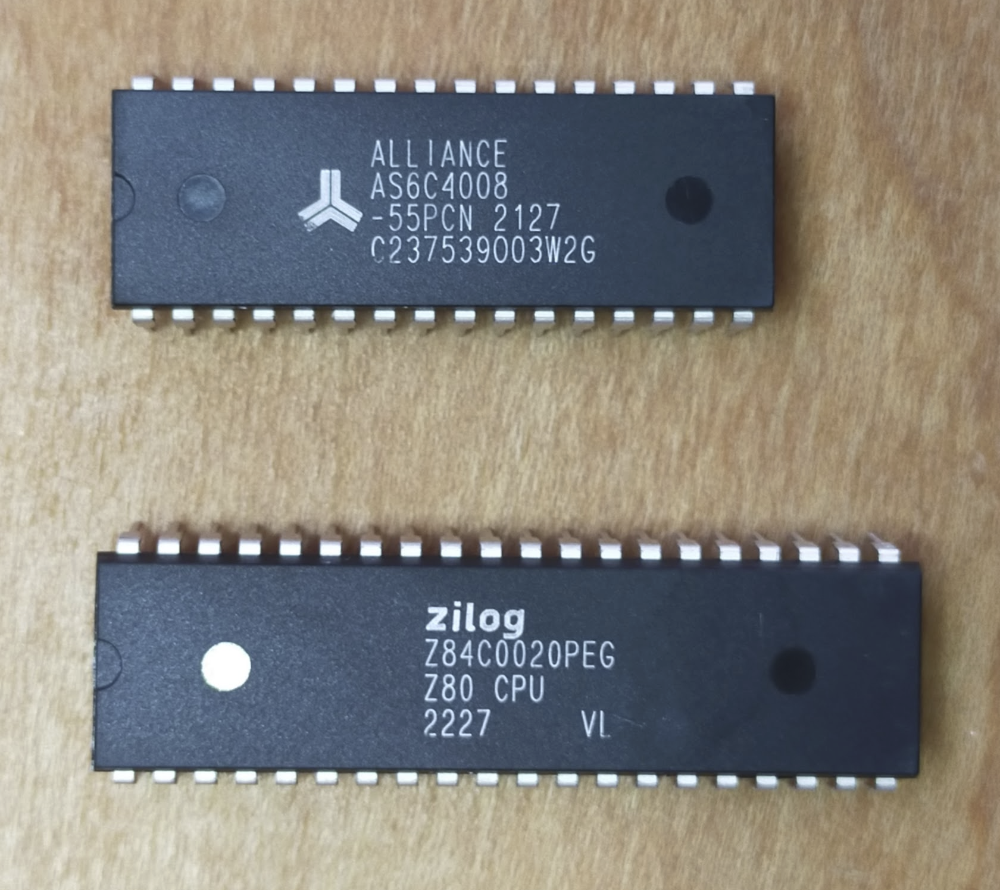
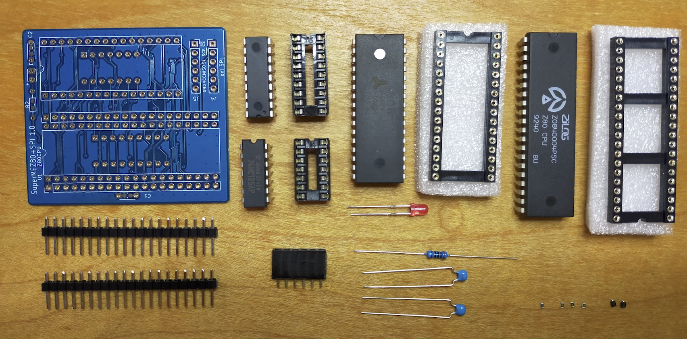
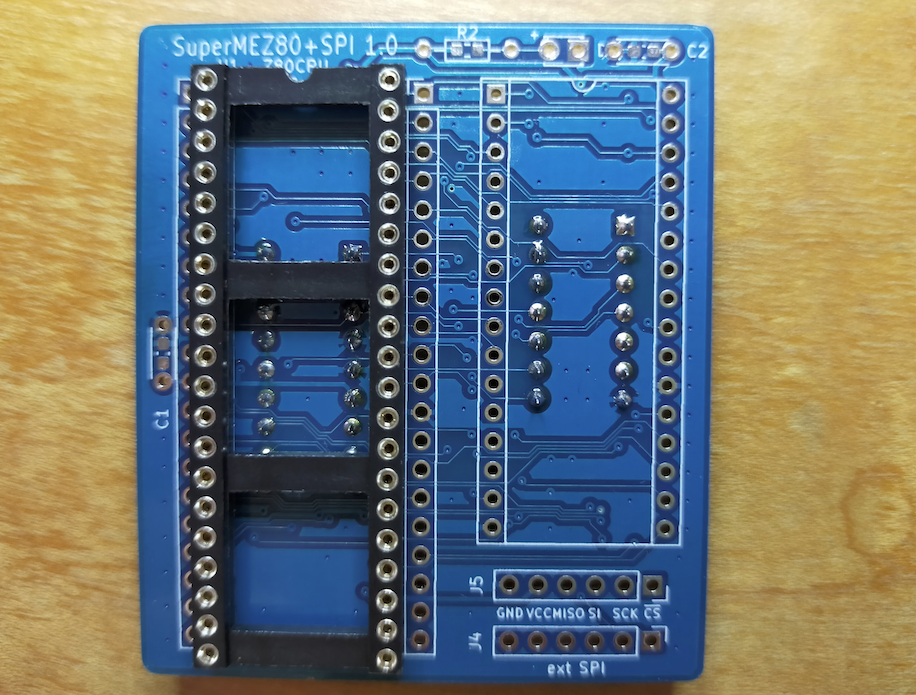
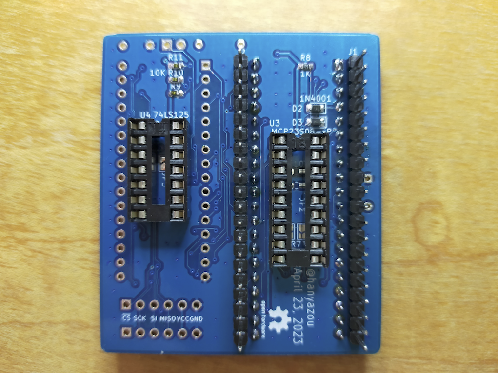

# SuperMEZ80-CPM
SuperMEZ80-CPM is a Z80 mezzanine board for simple single board computer EMUZ80.
SuperMEZ80-CPM adds SRAM and SPI micro SD Card slot to the EMUZ80.
With SuperMEZ80-CPM, you can run CP/M 2.2 and 3.0 disk images from the z80pack on the EMUZ80.

SuperMEZ80-CPM Features
  * Simple 3-chip configuration of Z80, SRAM and PIC
  * CP/M 3.0 banked memory can be used
  * A retro appearance, all chips are DIP, no surface-mounted components

SuperMEZ80-CPM is derived from satoshiokue's MEZ80RAM board.
Both EMUZ80 and MEZ80RAM are very interesting ideas.

SuperMEZ80-CPM is similar to the SuperMEZ80-SPI.
SuperMEZ80-CPM is simpler board with fewer components by removing I/O expander chip from SuperMEZ80-SPI.

## Appearance
The blue board in the following photo is SuperMEZ80-CPM and the red board is EMUZ80.

## Components you need

### IC
  * 1 Z80 (DIP 40 pin) *1
  * 1 AS6C4008-55 SRAM 4Mbit (DIP 32 pin) *2
### Through hole components
  * 1 IC socket (DIP 40 pin)
  * 1 IC socket (DIP 32 pin)
  * 1 SD Card slot *3
  * 2 Capacitor 0.1uF
  * 3 LED
  * 3 Resistor 1.5K ohms 1/4W (the value of resistor will vary depending on the LED)
  * 1 Resistor array 10K ohms x8
  * 2 Pin header (0.1" pich 20x1 pin)
  * 1 Jumper cap and header (0.1" pich) *4
  * 1 Pin socket (0.1" pich 6x1 pin)

*1) Z80C0006 (6MHz) or higher are recomended

*2) 2Mbit (256KB) or more is required for CP/M 3.0.
CP/M 2.2 can still run with 512Kbit (64KB) or 1Mbit (128KB) RAM like TC551001.

*3) For the micro SD Card slot, use the one for Arduino as shown in the following page.

https://circuitdigest.com/microcontroller-projects/interfacing-micro-sd-card-module-with-arduino

*4) I use right angle pin header and jumper.
They are useful when I experiment external clock source. 
But you can omit them and just short RA3 - Z80 CLK with solder.

## Build Instructions

Due to some tall components, it is recommended to assemble them in the following order.

### Step 1: DIP 40 socket

### Step 2: pin headers

### Step 3: LED and passive components

### Step 4: DIP 32 socket and 6 pin socket

## (Optional) SD card slot modification
SD Card slot component in the market may have a right angle pin header.
As it is, it might be little bit ugly as shown in the picture.

I de-soldered and replaced the header and mounted the SD card slot in back of SuperMEZ80-CPM.

You can also mount the SD Card slot on the top of the board like SuperMEZ-SPI.

## References
### SuperMEZ80 (derived version for SuperMEZ80-CPM)
Use this firmware to PIC on the EMUZ80 board.

https://github.com/hanyazou/SuperMEZ80

### EMUZ80
https://vintagechips.wordpress.com/2022/03/05/emuz80_reference/

### z80pack
https://github.com/udo-munk/z80pack

### MEZ80RAM
https://github.com/satoshiokue/MEZ80RAM

### SuperMEZ80 (Satoshi Okue's original FW for MEZ80RAM)
https://github.com/satoshiokue/SuperMEZ80

### SuperMEZ80-SPI
https://github.com/hanyazou/SuperMEZ80-SPI
