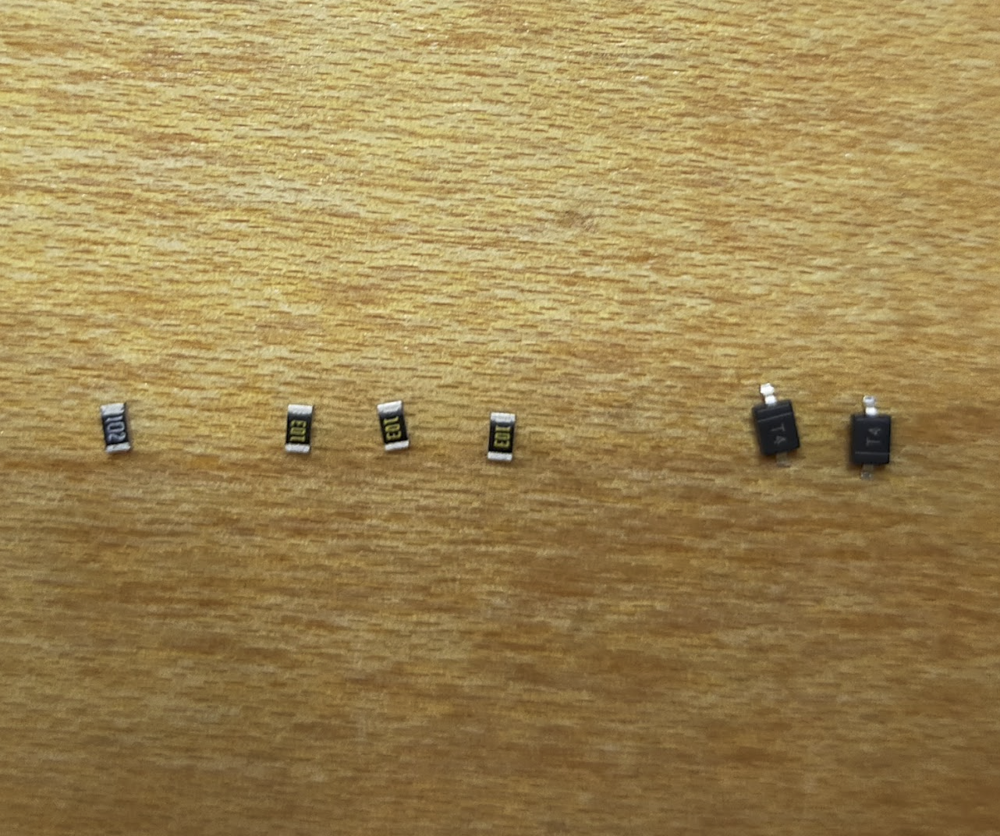
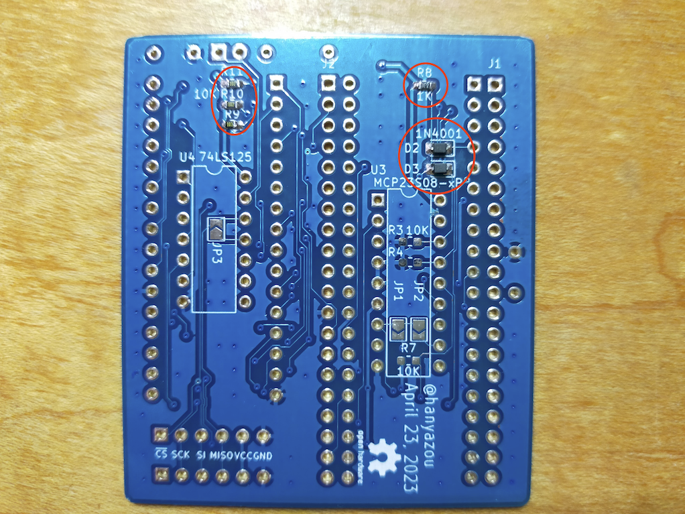
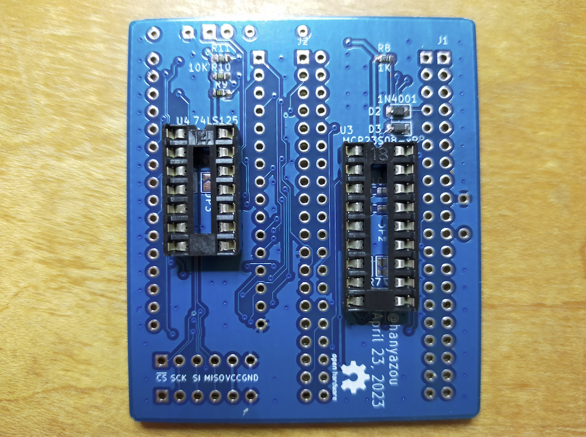
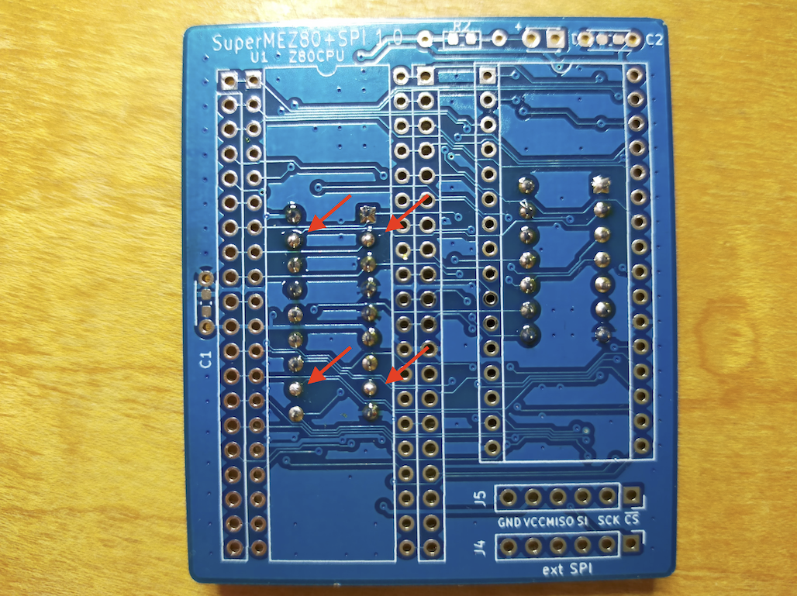
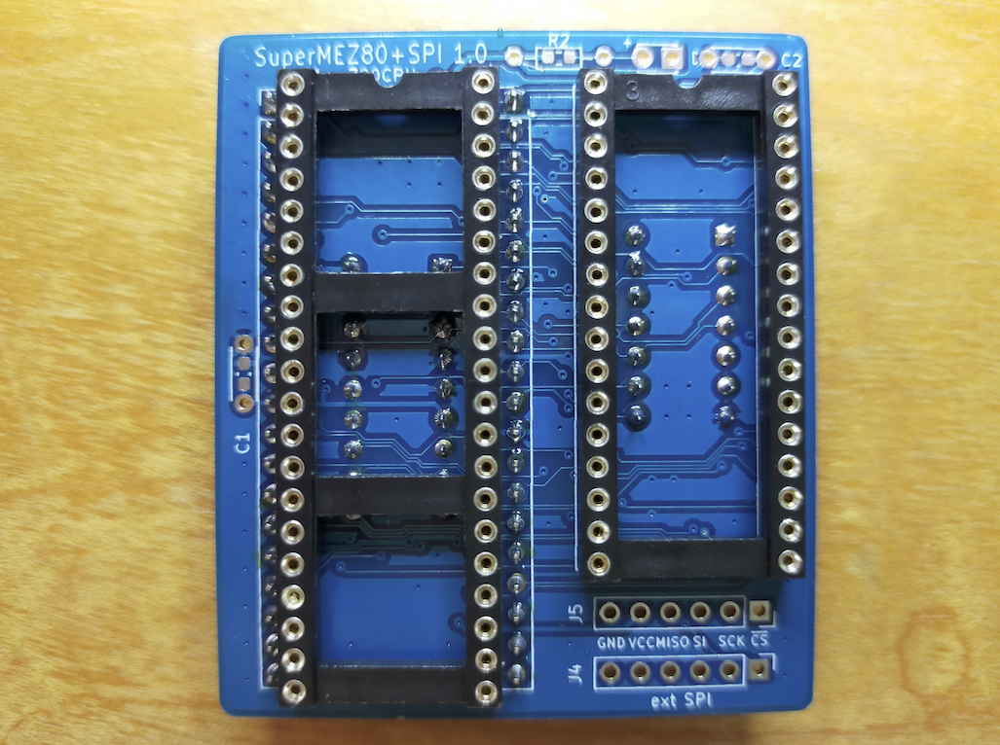
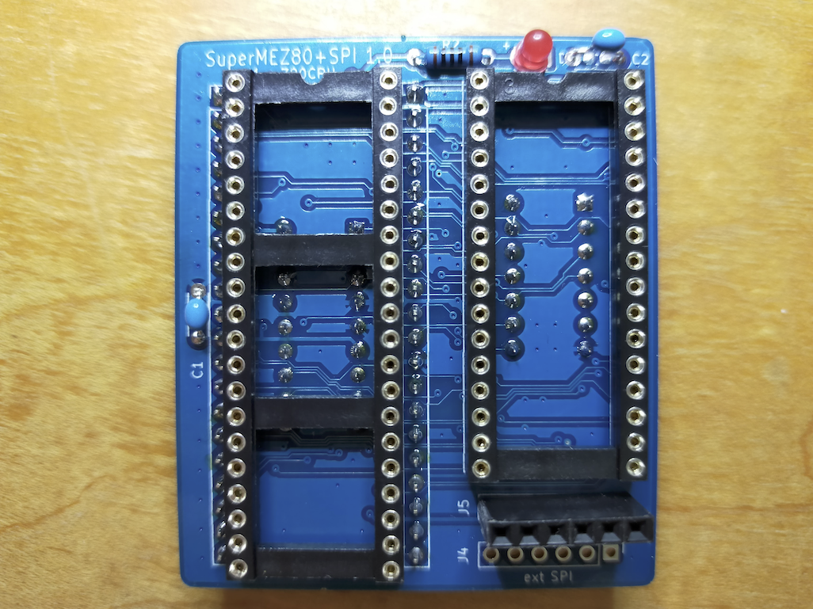
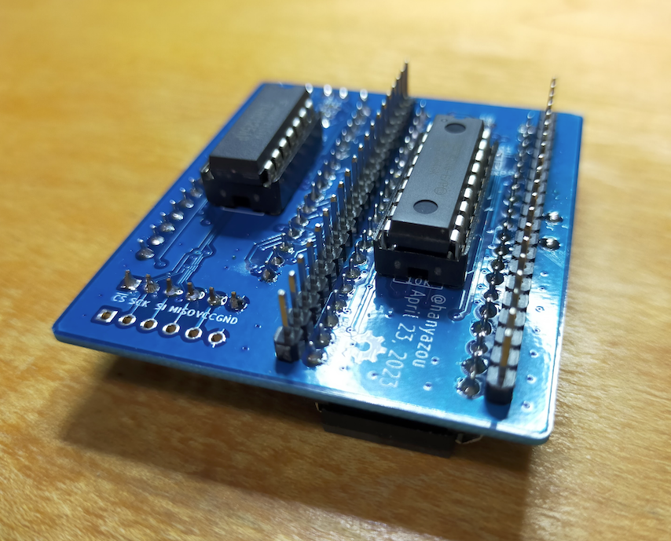

# SuperMEZ80-SPI
SuperMEZ80-SPI is a Z80 mezzanine board for simple single board computer EMUZ80.
SuperMEZ80-SPI add SRAM and SPI micro SD Card slot to the EMUZ80.
With SuperMEZ80-SPI, you can run CP/M 2.2 disk images from the z80pack on the EMUZ80.

SuperMEZ80-SPI is derived from satoshiokue's MEZ80RAM board.
Both EMUZ80 and MEZ80RAM are very interesting ideas.

## Appearance
The blue board in the following photo is SuperMEZ80-SPI and the red board is EMUZ80.

## Components you need

### IC
  * 1 Z80 6MHz (DIP 40 pin)
  * 1 AS6C4008-55 SRAM 4Mbit (DIP 32 pin)
  * 1 MCP23S08 I/O expander (DIP 18 pin)
  * 1 74HC125 3-State buffer x4 (DIP 14 pin)
### Through hole components
  * 1 LED
  * 1 Resistor 1.5K ohms 1/4W (the value of resistor will vary depending on the LED)
  * 2 Capacitor 0.1uF
  * 1 IC socket (DIP 40 pin)
  * 1 IC socket (DIP 32 pin)
  * 1 IC socket (DIP 18 pin) *
  * 1 IC socket (DIP 14 pin)
  * 2 Pin header (0.1" pich 20x1 pin)
  * 1 Pin socket (0.1" pich 6x1 pin)
### Surface mount devices
  * 1 Resistor 1K ohms 0603
  * 3 Resistor 10K ohms 0603
  * 2 Diode 1N4148 0805 (SOD 323)

*) If you use this socket, MCP23S08 might collide with the Z80 socket	on the EMUZ80.
In the case they collide, you might cut off	some of	the Z80	socket part
or avoid this DIP 18 socket and	solder the MCP23S08 on to the SuperMEZ80-SPI PCB directly.

### Other moduels
In addition, EMUZ80 and micro SD Card slot module are required.
For the micro SD Card slot, use the one for Arduino as shown in the following page.

https://circuitdigest.com/microcontroller-projects/interfacing-micro-sd-card-module-with-arduino

## Build Instructions

Due to some tall components, it is recommended to assemble them in the following order.

### Step 1: small surface mount devices

### Step 2: smaller DIP sockets

### Step 3: DIP 40 socket

You might cut some of DIP 18 pins because the pins collide with the DIP 40 socket.

### Step 4: pin headers

### Step 5: DIP 32 socket

### Step 6: remaining components

## References
### EMUZ80
https://vintagechips.wordpress.com/2022/03/05/emuz80_reference/
### z80pack
https://github.com/udo-munk/z80pack
### MEZ80RAM
https://github.com/satoshiokue/MEZ80RAM
### SuperMEZ80 (Satoshi Okue's original FW for MEZ80RAM)
https://github.com/satoshiokue/SuperMEZ80
### SuperMEZ80 (derived version for SuperMEZ80-SPI)
https://github.com/hanyazou/SuperMEZ80
